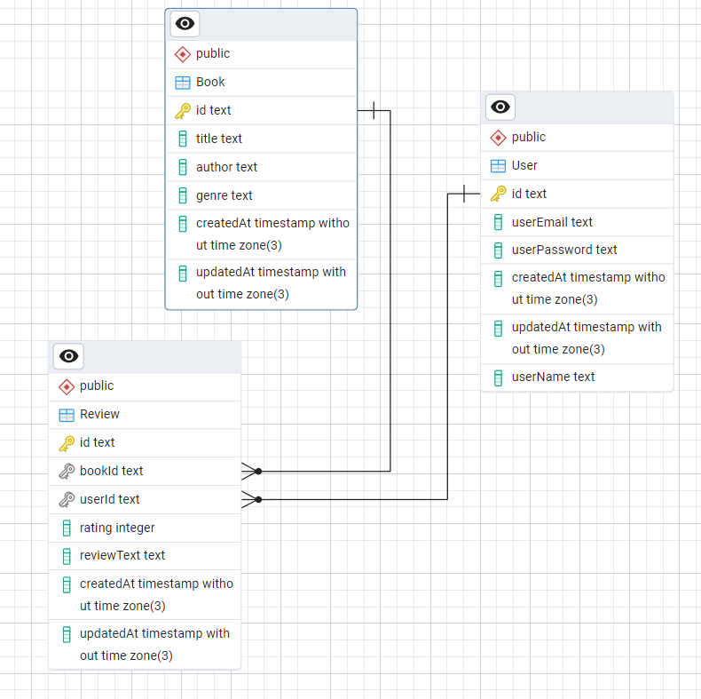

# Book Review API

    This is a RESTful API built with **Node.js**, **Express**, and **Prisma ORM** to manage books, users, and reviews.

# Features

    - User authentication using JWT
    - Add, fetch, and delete reviews (one review per user per book)
    - Get book details with average ratings and paginated reviews
    - Secure routes using middleware
    - Input validation using `express-validator`

##  Tech Stack

    - Node.js + Express
    - TypeScript
    - Prisma ORM
    - PostgreSQL / MySQL
    - JWT Auth
    - Express Validator

# Project Setup

# 1. Clone the repository
    git clone https://github.com/anshuu23/billeasy-assignment.git
    
# 2. Install dependencies
    npm install
    
# 3. Setup environment variables
    Create a .env file in the root:
    DATABASE_URL=your_Prisma_connection_string
    PORT=3000
    SECRET_KEY=your_jwt_secret
  
# 4. Prisma setup
    npx prisma generate
    npx prisma migrate dev --name init

# 5. Run the Server Locally
    npm start

## Postman Requests
   [Download Postman Collection](./Bill-easy-assignment.postman_collection.json)

# schemas

